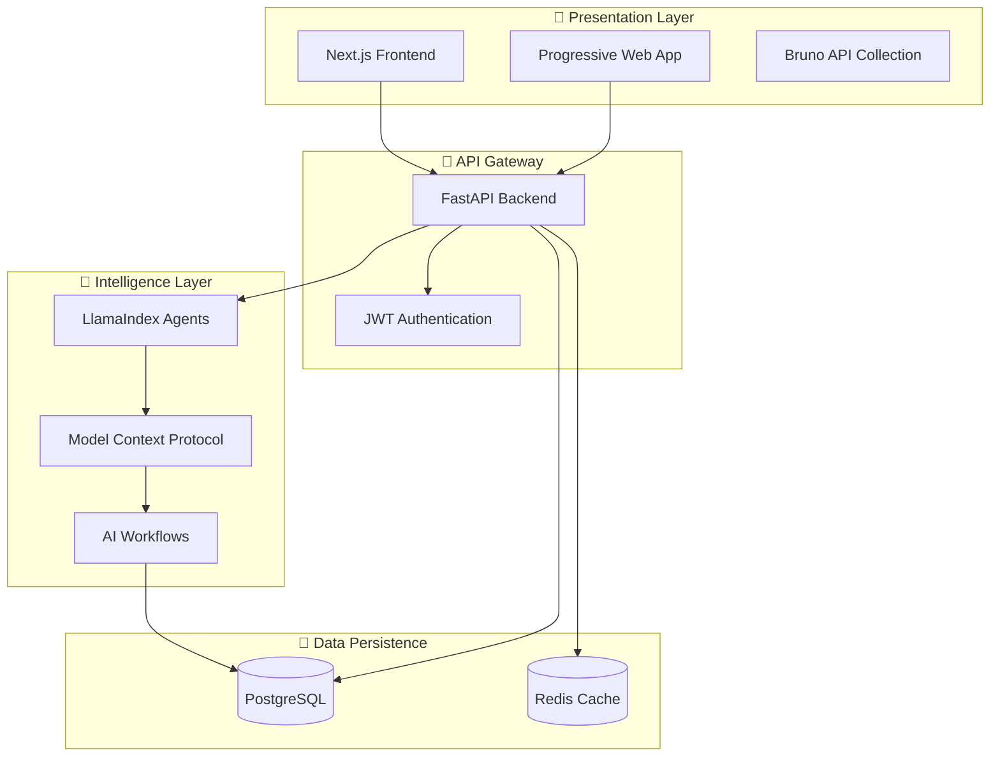

<div align="center">
  
  <!-- Dynamic Typing Animation -->
  <h1>
    
  </h1>
  
  <!-- Project Logo/Badge -->
  
  
  <p align="center">
    <em><strong>🎯 Diligent perseverance through intelligent automation</strong></em>
  </p>

  <!-- Live Demo Badge -->
  <p align="center">
    <a href="https://telaten.vercel.app" target="_blank">
      
    </a>
  </p>

  <br/>

  <!-- Tech Stack Showcase -->
  <h3>🛠️ Built with Modern Technologies</h3>
  <p>
    
    
    
    
  </p>

  <p>
    
    
    
    
  </p>

</div>

---

## 🌟 Project Overview

**Telaten** (from Javanese: _"diligent, patient perseverance"_) is a comprehensive **AI-powered business growth platform** specifically designed for Indonesian MSMEs (Micro, Small, and Medium Enterprises). Our platform combines intelligent automation with traditional business wisdom to create a powerful tool for sustainable growth.

> **🌐 Try it now**: **[Live Demo at telaten.vercel.app](https://telaten.vercel.app)** - Experience the full Telaten platform in action!

### 🎯 **Our Mission**

Empowering Indonesian small businesses through AI-driven insights, automated milestone generation, and gamified business development that makes growth both achievable and enjoyable.

---

## ✨ Key Innovations

<table>
<tr>
<td width="50%">

### 🤖 **AI-Powered Business Intelligence**

- **Smart Milestone Generation**: Personalized business goals
- **Context-Aware Chat**: Business advisor with memory
- **Predictive Analytics**: Financial insights and trends
- **Automated Workflows**: Streamlined business processes

</td>
<td width="50%">

### 🎮 **Gamified Growth Experience**

- **Progressive Levels**: Bronze → Silver → Gold → Platinum
- **Achievement System**: Unlock badges for milestones
- **Competitive Leaderboards**: Business community rankings
- **Reward Mechanisms**: Points for consistent activities

</td>
</tr>
<tr>
<td width="50%">

### 💰 **Comprehensive Financial Management**

- **Intelligent Transaction Recording**: Natural language input
- **Real-time Analytics**: Live financial dashboards
- **Category Intelligence**: Smart expense categorization
- **Automated Reporting**: Period-based financial summaries

</td>
<td width="50%">

### 📱 **Modern User Experience**

- **Mobile-First Design**: Optimized for smartphones
- **Progressive Web App**: App-like experience
- **Real-time Updates**: Server-Sent Events integration
- **Responsive Interface**: Works on all devices

</td>
</tr>
</table>

---

## 🏗️ Architecture & Technology

### 🔗 **Microservices Architecture**



### 🛠️ **Technology Stack Deep Dive**

#### **Backend Infrastructure**

| **Component**     | **Technology**               | **Purpose**                   | **Why Chosen**                              |
| ----------------- | ---------------------------- | ----------------------------- | ------------------------------------------- |
| **API Framework** | FastAPI                      | High-performance async API    | Type safety, auto-documentation, speed      |
| **Database**      | PostgreSQL                   | ACID-compliant data storage   | Reliability, JSON support, scalability      |
| **ORM**           | SQLModel                     | Type-safe database operations | FastAPI integration, Pydantic compatibility |
| **AI Engine**     | LlamaIndex                   | LLM orchestration framework   | Advanced RAG, tool integration              |
| **Protocol**      | MCP (Model Context Protocol) | AI tool standardization       | Extensibility, future-proofing              |

#### **Frontend Architecture**

| **Component**  | **Technology**        | **Purpose**                      | **Why Chosen**                        |
| -------------- | --------------------- | -------------------------------- | ------------------------------------- |
| **Framework**  | Next.js 14            | React-based full-stack framework | App Router, SSR, performance          |
| **Language**   | TypeScript            | Type-safe JavaScript             | Developer experience, maintainability |
| **Styling**    | Tailwind CSS          | Utility-first CSS framework      | Rapid development, consistency        |
| **UI Library** | shadcn/ui + Radix     | Accessible component system      | Design system, accessibility          |
| **State**      | Zustand + React Query | Client/server state management   | Simplicity, performance               |

---

## 🚀 Quick Start Guide

### 📋 **Prerequisites**

- **Python** ≥ 3.12
- **Node.js** ≥ 18.0
- **PostgreSQL** ≥ 14.0
- **Git** with submodule support

### ⚡ **One-Command Setup**

```bash
# Clone with all submodules
git clone --recurse-submodules https://github.com/TELATEN/telaten-apps.git
cd telaten-apps

# Backend setup
cd telaten-backend
cp .env.example .env  # Configure your environment
uv sync && uv run python run.py &

# Frontend setup
cd ../telaten-client
cp .env.example .env.local  # Configure API endpoint
bun install && bun dev &

# API documentation
cd ../telaten-docs-api
# Open with Bruno app

# Access points:
# 🌐  Live Demo: https://telaten.vercel.app
# 🖥️  Frontend: http://localhost:3000
# 🔧  Backend:  http://localhost:8000
# 📚  API Docs: http://localhost:8000/docs
```

---

## 📊 Project Statistics

<div align="center">

### 📈 **Development Metrics**

<table>
<tr>
<td align="center">
<strong>🔧 Backend</strong><br/>

<br/>
<strong>50+ modules</strong><br/>
<em>Type-safe, documented</em>
</td>
<td align="center">
<strong>🎨 Frontend</strong><br/>

<br/>
<strong>100+ components</strong><br/>
<em>Responsive, accessible</em>
</td>
<td align="center">
<strong>📚 Documentation</strong><br/>

<br/>
<strong>Comprehensive</strong><br/>
<em>Setup to deployment</em>
</td>
</tr>
</table>

### 🎯 **Feature Coverage**

```
🔐 Authentication & Authorization    ████████████████████ 100%
🏢 Business Profile Management       ████████████████████ 100%
💰 Financial Tracking & Analytics    ████████████████████ 100%
🎯 AI-Powered Milestone Generation   ████████████████████ 100%
🏆 Gamification & Achievements       ████████████████████ 100%
💬 Real-time AI Chat Assistant       ████████████████████ 100%
📱 Mobile-Responsive Design          ████████████████████ 100%
📊 Analytics & Reporting             ████████████████████ 100%
```

</div>

---

## 🎯 Target Impact

### 🇮🇩 **For Indonesian MSMEs**

<div align="center">

|       **Before Telaten**        |     **After Telaten**      |
| :-----------------------------: | :------------------------: |
|      📝 Manual bookkeeping      |  🤖 AI-automated tracking  |
|    ❓ Unclear business goals    | 🎯 AI-generated milestones |
| 😰 Overwhelming growth planning |  🎮 Gamified progression   |
|     📊 No business insights     |   📈 Real-time analytics   |
|        🏃‍♀️ Working alone         | 👥 Community leaderboards  |

</div>

### 📊 **Expected Outcomes**

- **⏰ 70% reduction** in financial record-keeping time
- **📈 40% improvement** in business goal completion
- **🎯 85% increase** in consistent financial tracking
- **🤝 60% growth** in business community engagement

---

## 🛣️ Roadmap & Future Vision

### 🔮 **Phase 1: Foundation** ✅ _Completed_

- [x] Core AI chat functionality with context awareness
- [x] Comprehensive financial tracking system
- [x] AI-powered milestone management
- [x] User authentication & business profiles
- [x] Real-time SSE integration
- [x] Mobile-responsive PWA design

### 🚀 **Phase 2: Intelligence Enhancement** ✅ _Completed_

- [x] Advanced AI milestone generation with personalization
- [x] Real-time business analytics & dashboards
- [x] Complete gamification system (levels, achievements, leaderboards)
- [x] Interactive Bruno API documentation
- [x] Production-ready deployment architecture

### 🌟 **Phase 3: Content & Social Integration** 🔄 _In Progress_

- [ ] **📱 Social Media Integration**
  - [ ] Auto-post milestone achievements to Instagram/Facebook
  - [ ] Share business progress on TikTok with templates
  - [ ] LinkedIn business updates automation
  - [ ] WhatsApp Business integration for customer updates
- [ ] **🎨 AI Content Creation**
  - [ ] Auto-generate social media captions in Indonesian/English
  - [ ] Create promotional graphics for milestones & achievements
  - [ ] Generate business story content for marketing
  - [ ] AI-powered product description creation
- [ ] **📊 Advanced Analytics**
  - [ ] Predictive business forecasting with AI
  - [ ] Market trend analysis for Indonesian MSMEs
  - [ ] Competitor analysis and insights
  - [ ] Customer behavior analytics integration
- [ ] **📸 Smart Receipt Recognition**
  - [ ] OCR technology for automatic receipt scanning
  - [ ] Photo-to-transaction conversion with AI verification
  - [ ] Support for Indonesian receipt formats & languages
  - [ ] Bulk receipt processing for batch uploads
  - [ ] Smart categorization from receipt merchant data
  - [ ] Integration with major Indonesian retailers (Indomaret, Alfamart, etc.)

### 🌐 **Phase 4: Ecosystem Expansion** 📋 _Planned_

- [ ] **🏪 E-commerce Integration**
  - [ ] Shopee/Tokopedia sales sync & analytics
  - [ ] Instagram Shopping automation
  - [ ] WhatsApp Catalog integration
  - [ ] Cross-platform inventory management
- [ ] **🏦 Financial Services**
  - [ ] Indonesian banking APIs (BCA, Mandiri, BRI, BNI)
  - [ ] Digital wallet integration (OVO, GoPay, DANA)
  - [ ] Automated invoice generation & sending
  - [ ] Tax calculation & reporting for Indonesian businesses
- [ ] **🤝 Community & Networking**
  - [ ] MSME community forum within app
  - [ ] Peer-to-peer business advice platform
  - [ ] Local business directory & discovery
  - [ ] Collaboration tools for business partnerships

### 🚀 **Phase 5: AI Revolution** 🔮 _Future Vision_

- [ ] **🧠 Advanced AI Capabilities**
  - [ ] Computer vision for inventory management
  - [ ] Voice-to-text transaction recording in Bahasa Indonesia
  - [ ] AI customer service chatbots for businesses
  - [ ] Predictive maintenance for business operations
- [ ] **🌍 Regional Expansion**
  - [ ] Southeast Asian market adaptation (Thailand, Malaysia, Philippines)
  - [ ] Local language support (Thai, Malay, Filipino)
  - [ ] Regional banking & payment integrations
  - [ ] Cultural business practice adaptations
- [ ] **🔗 Blockchain & Web3**
  - [ ] Supply chain transparency for Indonesian products
  - [ ] Digital certificates for business achievements
  - [ ] Decentralized business reputation system
  - [ ] Crypto payment options for tech-savvy businesses

### 🎯 **Phase 6: Enterprise & Scale** 💼 _Long-term Vision_

- [ ] **🏢 Enterprise Solutions**
  - [ ] Multi-tenant SaaS architecture
  - [ ] White-label solutions for banks & corporations
  - [ ] API marketplace for third-party integrations
  - [ ] Advanced business intelligence & reporting
- [ ] **🎓 Education & Training**
  - [ ] AI-powered business coaching certification
  - [ ] MSME university with interactive courses
  - [ ] Mentorship matching platform
  - [ ] Business skill assessment & development
- [ ] **🌟 Innovation Labs**
  - [ ] AR/VR for virtual business consultations
  - [ ] IoT integration for smart business operations
  - [ ] Machine learning for hyper-personalization
  - [ ] Quantum computing for complex business optimization

### 🎊 **Special Initiatives**

- [ ] **🇮🇩 Indonesia Digital Economy**
  - [ ] Partnership with Indonesian government initiatives
  - [ ] Support for rural MSME digitalization
  - [ ] Integration with Indonesia's digital ID (KTP Elektronik)
  - [ ] Contribution to Indonesia's 2030 digital economy goals
- [ ] **🌱 Sustainability Features**
  - [ ] Carbon footprint tracking for businesses
  - [ ] Sustainable business practice recommendations
  - [ ] Green business certification system
  - [ ] Environmental impact analytics

---

## 🤝 Contributing & Community

### 👥 **How to Contribute**

We welcome contributions from developers, designers, business experts, and Indonesian MSME owners!

<div align="center">

| **Role**                | **How You Can Help**                | **Get Started**                                                                        |
| ----------------------- | ----------------------------------- | -------------------------------------------------------------------------------------- |
| **🧑‍💻 Developers**       | Code improvements, new features     | [Development Guide](https://github.com/TELATEN/telaten-backend/blob/main/README.md)    |
| **🎨 Designers**        | UI/UX enhancements, user research   | [Design System](https://github.com/TELATEN/telaten-client/blob/main/README.md)         |
| **💼 Business Experts** | Feature validation, market insights | [Project Architecture](https://github.com/TELATEN/telaten-backend/blob/main/README.md) |
| **🏪 MSME Owners**      | User testing, feedback, use cases   | [Live Demo Testing](https://telaten.vercel.app)                                        |

</div>

### 🌍 **Community Guidelines**

- **🤝 Respectful**: We value diverse perspectives and Indonesian business culture
- **🎯 Purpose-driven**: Every contribution should help MSMEs grow
- **📚 Educational**: Share knowledge and learn together
- **🔄 Collaborative**: Work together to build something amazing

---

## 📞 Support & Resources

### 🆘 **Getting Help**

<div align="center">

| **Issue Type**          | **Best Channel**    | **Response Time** |
| ----------------------- | ------------------- | ----------------- |
| 🐛 **Bug Reports**      | GitHub Issues       | 24-48 hours       |
| 💡 **Feature Requests** | GitHub Discussions  | 3-5 days          |
| 📚 **Documentation**    | Wiki & README files | Self-service      |
| 🤝 **General Support**  | Community Discord   | Real-time         |

</div>

### 🔗 **Useful Links**

- 📖 **[Complete Documentation](./README.md)** - Full project overview
- 🔧 **[Backend Documentation](https://github.com/TELATEN/telaten-backend/blob/main/README.md)** - API and architecture
- 🎨 **[Frontend Documentation](https://github.com/TELATEN/telaten-client/blob/main/README.md)** - UI components and setup
- 🧪 **[API Testing](https://github.com/TELATEN/telaten-docs-api/blob/main/README.md)** - Interactive API collection
- 🏗️ **[Backend Architecture](https://github.com/TELATEN/telaten-backend/blob/main/README.md)** - Complete backend documentation

---

## 📄 License & Legal

This project is licensed under the **MIT License**, making it free and open-source for the Indonesian MSME community.

**💼 Commercial Use**: Permitted with attribution  
**🔄 Modifications**: Encouraged for community benefit  
**📢 Distribution**: Welcome with proper licensing

---

<div align="center">
  
  <h2>🇮🇩 Proudly Supporting Indonesian MSMEs</h2>
  
  <p>
    <strong>🎯 Every line of code, every feature, every decision is made with Indonesian small businesses in mind</strong>
  </p>

  <!-- Project Statistics -->
  <p>
    
    
    
  </p>

  <!-- Call to Action -->
  <p>
    <a href="https://telaten.vercel.app" target="_blank">
      
    </a>
    <a href="#-quick-start-guide">
      
    </a>
    <a href="./CONTRIBUTING.md">
      
    </a>
  </p>

  <br/>

  <p><em>🙏 Built with love and patience for the Indonesian entrepreneurial spirit</em></p>
  
  <p>
    <strong>Telaten: Maju Pelan - Pelan, Usaha Jadi Mapan</strong>
  </p>

</div>
