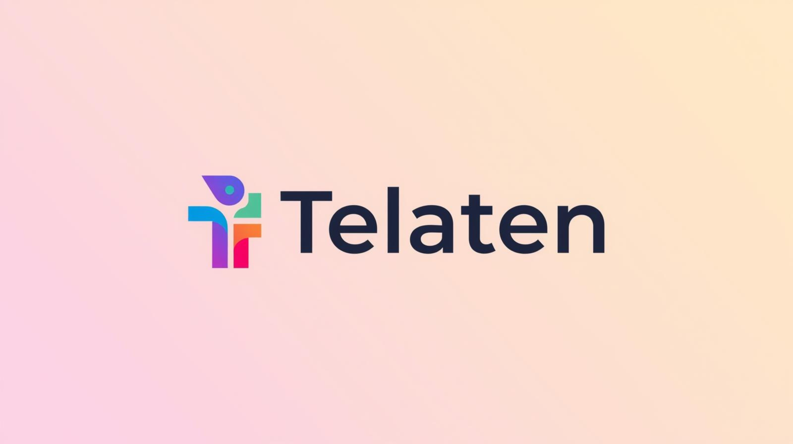

# Telaten

**Maju Pelan-Pelan, Usaha Jadi Mapan**

Telaten is an intelligent AI assistant designed specifically for Micro, Small, and Medium Enterprises (UMKM). We help business owners navigate their growth journey with personalized guidance, structured milestones, and a gamified experience to keep them motivated.

🌐 **Try the App**: [https://telaten.vercel.app/](https://telaten.vercel.app/)

## 🧠 Powered by AI
Telaten utilizes advanced AI agents to provide:
- **Context-Aware Consulting**: The AI understands your unique business profile, industry context, and current milestones.
- **Real-Time Streaming**: Experience fluid, conversational interactions that feel natural and responsive.
- **Strategic Insights**: Beyond simple answers, the AI analyzes your progress to suggest the next best steps for growth.

## 🚀 Key Features

### 🤖 AI Business Assistant
- **Context-Aware Chat**: Consult with an AI that understands your specific business profile.
- **Real-time Guidance**: Get instant answers and strategic advice for your daily operations.

### 📈 Milestone & Task Management
- **Structured Growth Path**: Break down big goals into manageable milestones.
- **Actionable Tasks**: Track progress with specific tasks to ensure you stay on course.
- **Progress Tracking**: Monitor your journey from start to success.

### 🏆 Gamification
- **Achievements**: Unlock badges and rewards as you complete business milestones.
- **Motivation**: Meaningful recognition for your hard work and progress.

### 💼 Business Profiling
- **Comprehensive Profile**: Manage your business identity and details in one place.
- **Tailored Experience**: All features adapt to your specific business context.

## 🔒 Security
We prioritize the safety of your business data:
- **Secure Authentication**: Robust user session management and protection.
- **Role-Based Access**: Strict separation between user and admin privileges to protect system integrity.
- **Data Privacy**: Your business strategies and insights remain private and secure.

## 🛠️ Tech Stack
- **Backend**: Python, FastAPI, SQLAlchemy
- **AI Integration**: Streaming chat completion
- **Database**: PostgreSQL

---
*Telaten - Your Partner in Business Growth.*
